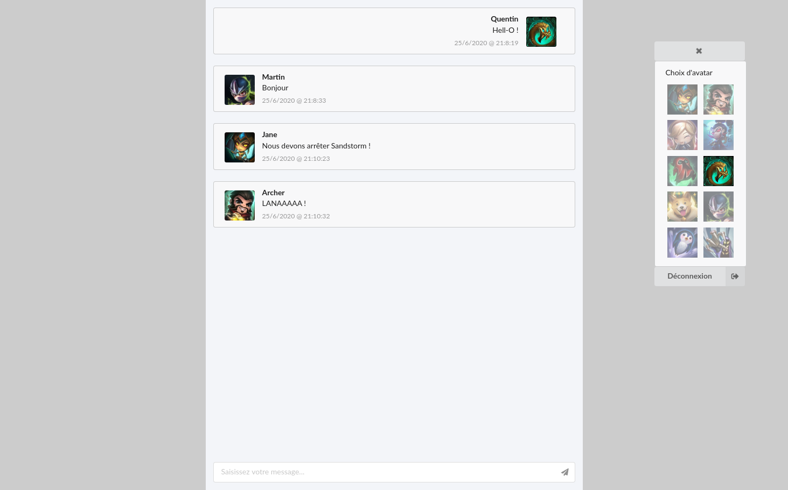

# ChatRoom

Salle de chat en temps réel.

Connexion, envoi et réception messages avec date/heure/avatar utilisateur, possiblité de changer d'avatar.

Front: React, Redux, Axios, Semantic UI.

Back: Node.js, Express.js, Socket.io.



## Lancement

Front:
```
yarn
yarn start
```

Back:
```
yarn
yarn start
```

## Connexion

Mail / Password
```
q@brh.fr
aqw
```

```
martin.dupont@baguette.fr
chocolatine
```

```
jane.doe@fbi.gouv
blindspot
```

```
archer.sterling@duchesse.gouv
LANA
```
